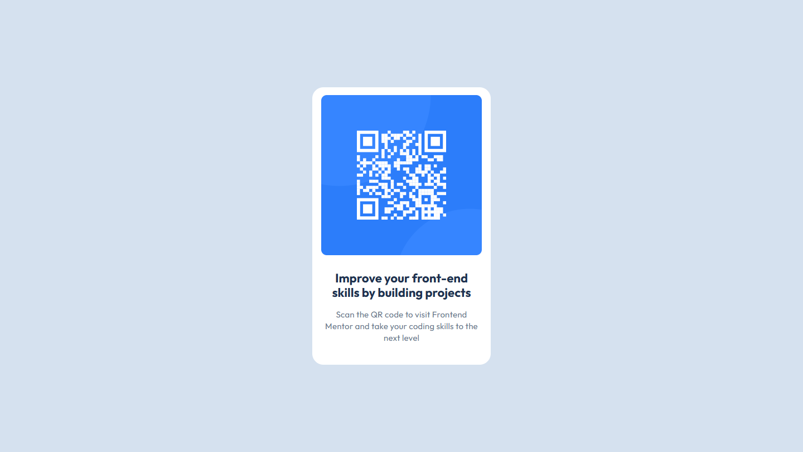

# Frontend Mentor - QR code component solution

This is a solution to the [QR code component challenge on Frontend Mentor](https://www.frontendmentor.io/challenges/qr-code-component-iux_sIO_H). Frontend Mentor challenges help you improve your coding skills by building realistic projects.

## Table of contents

- [Overview](#overview)
  - [Screenshot](#screenshot)
  - [Links](#links)
- [My process](#my-process)
  - [Built with](#built-with)
  - [What I learned](#what-i-learned)
  - [Continued development](#continued-development)
  - [Useful resources](#useful-resources)
- [Author](#author)

## Overview

### Screenshot



### Links

- Live Site URL: [https://fem-qr-omega.vercel.app/]

## My process

### Built with

- Semantic HTML5 markup
- CSS custom properties
- Flexbox
- Mobile-first workflow
- BEM methodology

### What I learned

During this project, I gained valuable experience in implementing a design from a style guide. Some key learnings include:

1. **Using CSS Custom Properties**: I utilized CSS variables for colors and spacing, making the code more maintainable:

```css
:root {
  --slate-300: #d5e1ef;
  --slate-500: #68778d;
  --slate-900: #1f314f;
  --white: #ffffff;

  --spacing-500: 40px;
  --spacing-300: 24px;
  --spacing-200: 16px;
}
```

2. **Implementing Typography Classes**: I created reusable typography classes based on the style guide:

```css
.text-preset-1 {
  font-family: "Outfit", sans-serif;
  font-weight: bold;
  font-size: 22px;
  line-height: 120%;
  letter-spacing: 0px;
}
```

3. **BEM Methodology**: I applied BEM naming conventions for better CSS organization:

```html
<div class="qr__wrapper">
  <div class="qr__image-container">
    
  </div>
  <div class="qr__text">
    <p class="qr__text-title text-preset-1">
      Improve your front-end skills by building projects
    </p>
    <p class="qr__text-subtitle text-preset-2">
      Scan the QR code to visit Frontend Mentor and take your coding skills to
      the next level
    </p>
  </div>
</div>
```

### Continued development

Moving forward, I want to focus on:

1. Improving accessibility practices
2. Implementing responsive design using media queries
3. Optimizing performance, especially for images
4. Exploring more advanced CSS techniques like CSS Grid

### Useful resources

- [CSS-Tricks Guide to Flexbox](https://css-tricks.com/snippets/css/a-guide-to-flexbox/) - This helped me understand Flexbox layout better.
- [MDN Web Docs](https://developer.mozilla.org/en-US/) - An invaluable resource for HTML and CSS references.
- [BEM Naming Convention](https://getbem.com/naming/) - This helped me understand and implement BEM methodology.

## Author

- Frontend Mentor - [@Saran-Sandeep](https://www.frontendmentor.io/profile/Saran-Sandeep)
